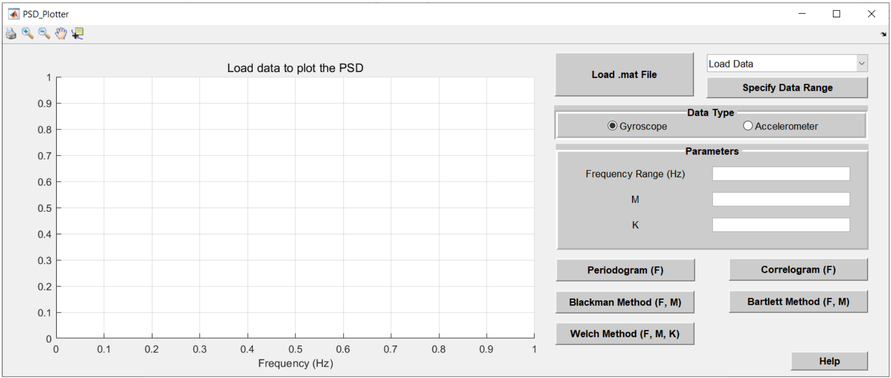

# Power Spectrum Density Plotter

MATLAB application with a graphical user interface to calculate and plot the power spectrum density of the signal data file using different PSD estimation methods according to user choice and input parameters.

Available estimation methods are Periodogram, Correlogram, Blackman-Tukey, Bartlett, and Welch.

## Application GUI

